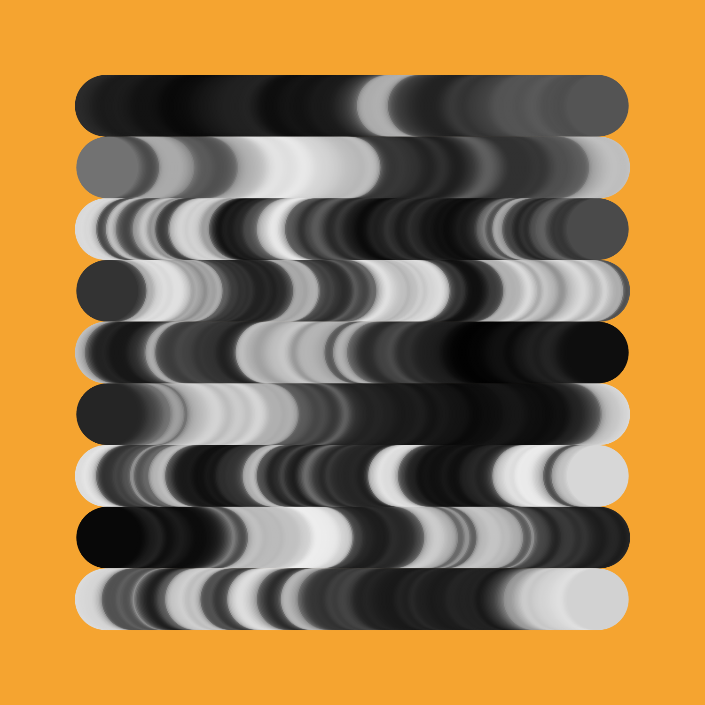
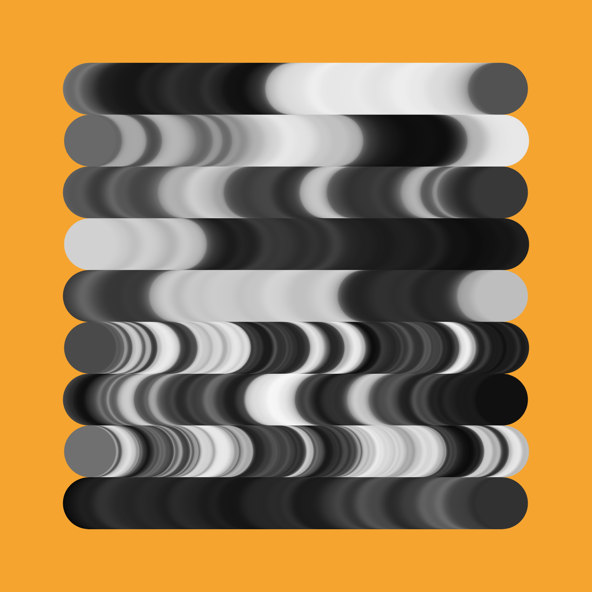
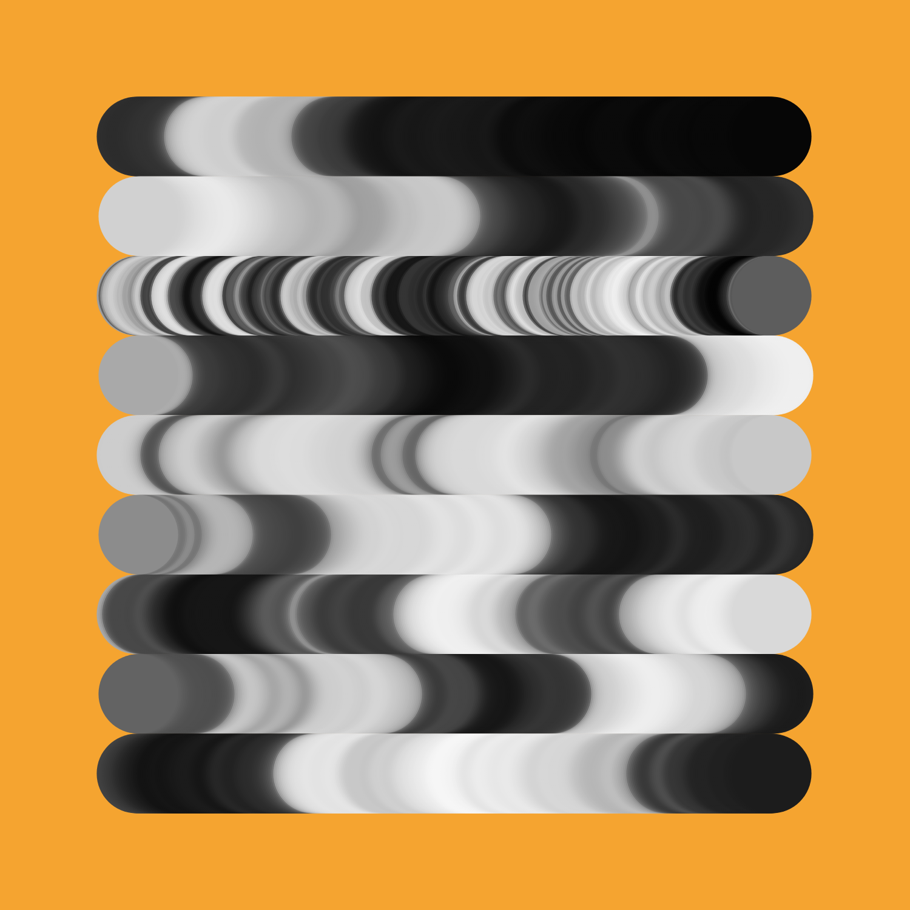
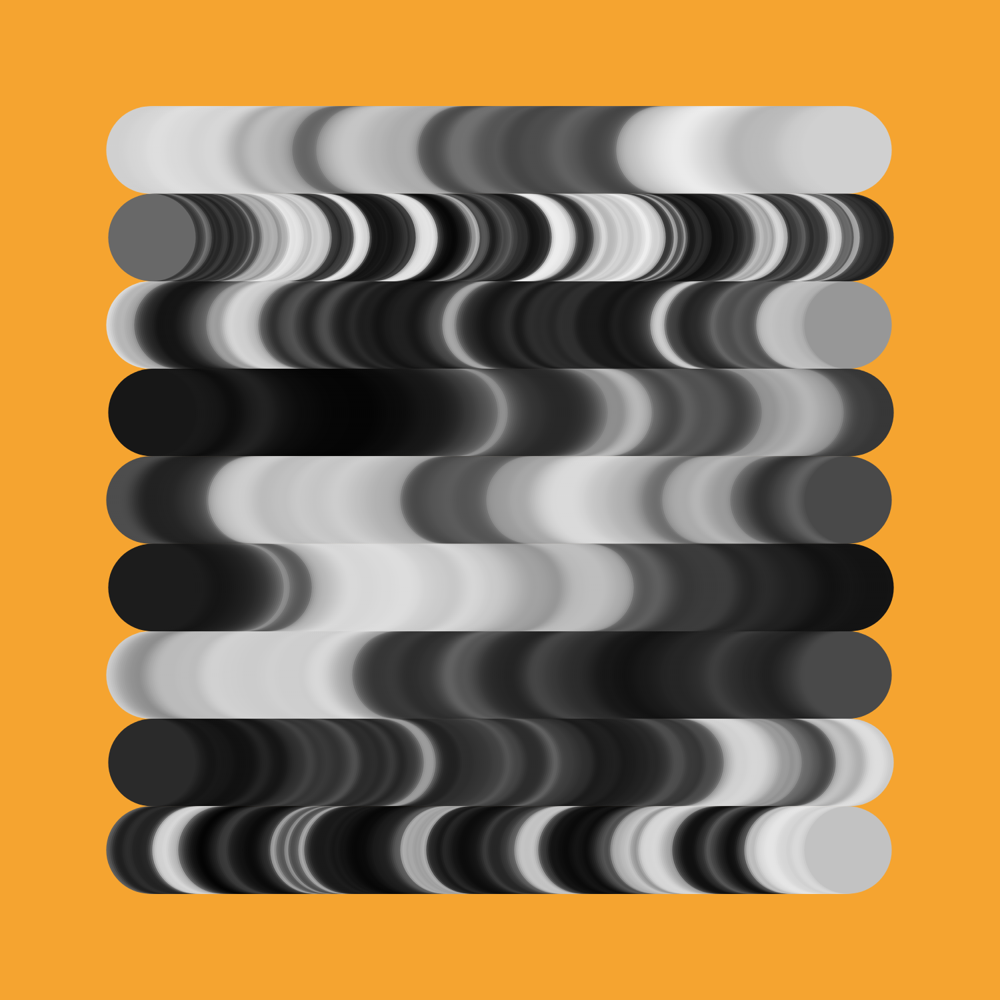
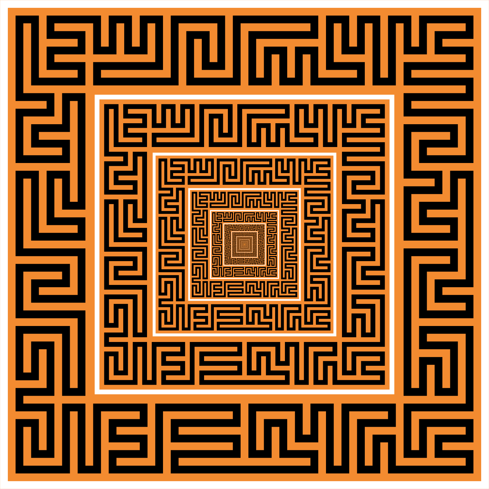
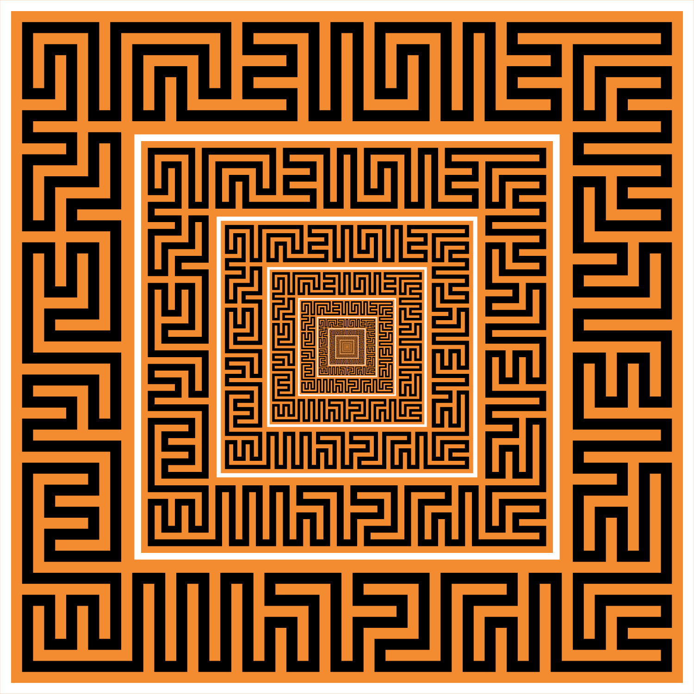
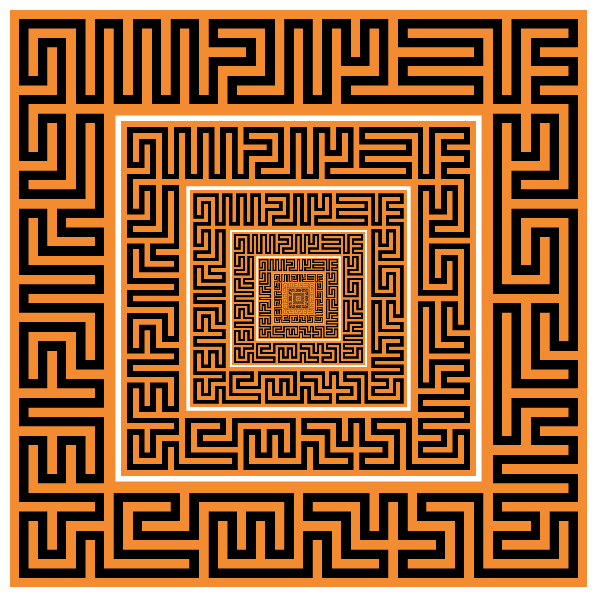
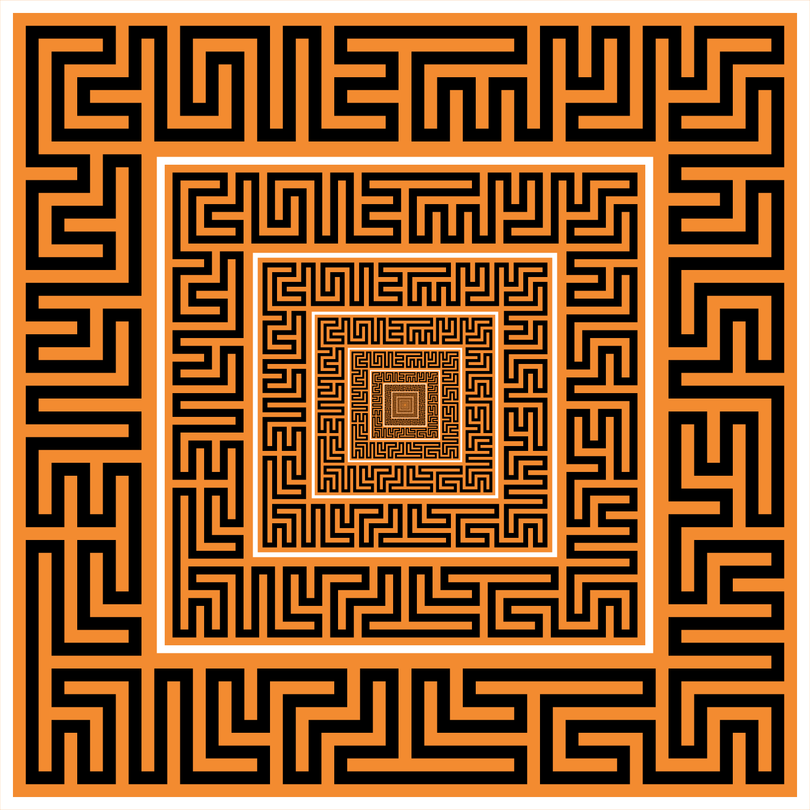

# Genuary 2024

[Genuary](genuary.art) is a month of daily generative art prompts, happening every January.

For this 2024 edition, I gave myself extra constraints: 
- square format, the result is a still image (not an animation);
- draw with only black, white or shades of gray;
- the background is one plain color, evolving every day.

### JAN. 1
> Particles, lots of them.

   

### JAN. 2
> No palettes.

   

### JAN. 3
> Droste effect.

   